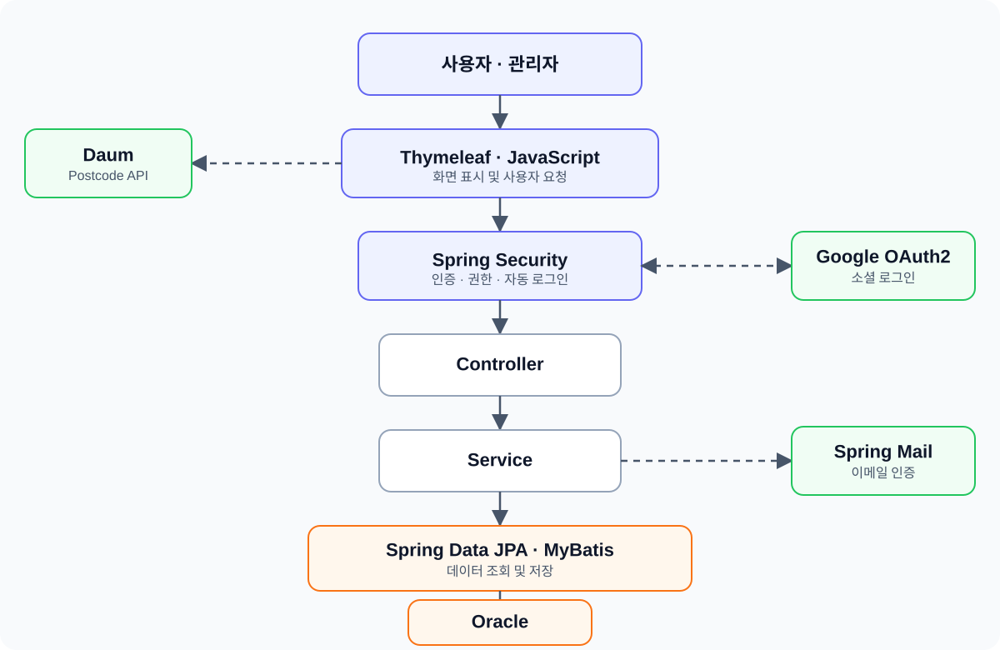
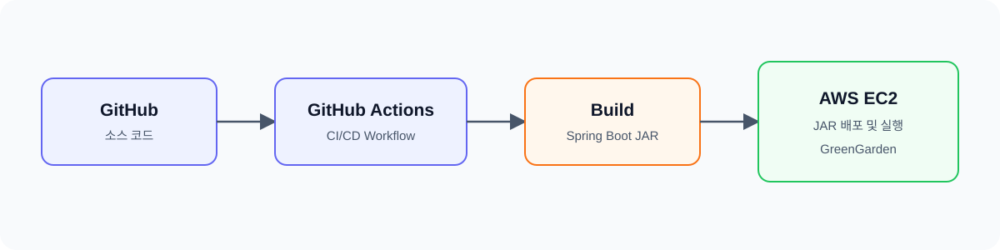

# 🌿 GreenGarden

BNK 부산은행 금융 DT 아카데미 개발자 양성과정에서 진행한 팀 프로젝트입니다.

사용자 쇼핑몰과 관리자 시스템을 함께 구현한 전자상거래 웹 애플리케이션입니다.

---

## 📌 프로젝트 개요

GreenGarden은 회원가입부터 상품 조회, 장바구니, 주문, 마이페이지까지 이어지는 사용자 쇼핑 기능과 상품·회원·주문·쿠폰·고객센터 등을 관리하는 관리자 기능을 구현한 프로젝트입니다.

| 구분      | 내용                                          |
| ------- | ------------------------------------------- |
| 프로젝트 형태 | 팀 프로젝트                                      |
| 팀 구성    | 6명                                          |
| 사용자 사이트 | 회원, 상품, 장바구니, 주문, 고객센터, 마이페이지, 회사소개, 서비스 정책 |
| 관리자 사이트 | 환경설정, 상점, 회원, 상품, 주문, 쿠폰, 고객센터, 채용 관리       |

---

## 👥 팀 구성

* 팀장: 서현우
* 팀원: 박효빈, 이수연, **이종봉**, 조지영, 한탁원

---

## 🖥️ 주요 화면

### 사용자 메인페이지

GreenGarden의 사용자 메인 화면입니다.

상품 카테고리와 추천 상품을 확인하고 상품 조회, 장바구니, 주문 등의 기능으로 이동할 수 있습니다.

<!-- 사용자 메인페이지 이미지 삽입 위치 -->

### 관리자 메인페이지

GreenGarden의 관리자 메인 화면입니다.

회원, 상품, 주문, 쿠폰, 고객센터 등 쇼핑몰 운영 정보를 확인하고 각 관리 기능으로 이동할 수 있습니다.

<!-- 관리자 메인페이지 이미지 삽입 위치 -->

---

## ⚙️ 기술 스택

| 구분            | 기술                                     |
| ------------- | -------------------------------------- |
| Frontend      | HTML5, CSS3, JavaScript, Thymeleaf     |
| Backend       | Java 17, Spring Boot, Spring MVC       |
| Security      | Spring Security, OAuth2 Client, BCrypt |
| Data          | Spring Data JPA, MyBatis               |
| Database      | Oracle                                 |
| API·기타        | Spring Mail, Daum Postcode API         |
| Infra         | AWS EC2, GitHub Actions                |
| Collaboration | GitHub, Figma, Slack, Notion           |

---

## 🏛️ 시스템 아키텍처



### 배포 구조



---

## 🏗️ 주요 기능

### 사용자 사이트

* 회원: 로그인, 회원가입, 아이디·비밀번호 찾기
* 상품: 상품목록, 상품상세, 장바구니, 주문, 검색
* 고객센터: 공지사항, FAQ, Q&A
* 마이페이지: 주문내역, 포인트, 쿠폰, 리뷰, 문의내역, 회원정보
* 회사소개: 회사 정보, 기업문화, 소식, 채용, 미디어
* 서비스 정책: 구매회원·판매회원 약관, 전자금융거래, 위치정보, 개인정보처리방침

### 관리자 사이트

* 환경설정: 기본설정, 배너, 약관, 카테고리, 버전 관리
* 상점관리: 상품목록, 매출현황
* 회원관리: 회원목록, 회원정보, 포인트 관리
* 상품관리: 상품현황, 상품등록
* 주문관리: 주문현황, 배송현황
* 쿠폰관리: 쿠폰목록, 쿠폰 발급현황
* 고객센터: 공지사항, FAQ, Q&A 관리
* 채용관리: 채용공고 관리

---

## 🗃️ ERD

회원, 상품, 주문, 장바구니, 쿠폰, 포인트, 고객센터 등 쇼핑몰의 주요 데이터를 기준으로 테이블 관계를 설계했습니다.

회원정보는 공통 회원 테이블을 기준으로 일반회원과 판매회원 정보를 분리하여 관리하도록 구성했습니다.

* 공통 회원정보: `TB_MEMBER`
* 일반회원 정보: `TB_MEMBER_GENERAL`
* 판매회원 정보: `TB_MEMBER_SELLER`
* 일반회원과 판매회원은 공통 회원 테이블의 아이디를 기준으로 연결

<!-- ERD 이미지 삽입 위치 -->

---

# 👨‍💻 담당 역할 — 회원 및 서비스 정책

프로젝트에서 **회원가입·로그인·계정 찾기·서비스 정책 기능**을 담당했습니다.

일반회원과 판매회원을 구분한 가입 절차를 구성하고, `SecurityConfig`를 이용해 일반 로그인·자동 로그인·Google 소셜 로그인 및 로그인 결과에 따른 화면 이동을 설정했습니다.

또한 회원 유형에 맞는 약관을 데이터베이스에서 조회하여 회원가입 과정과 서비스 정책 페이지에 연결했습니다.

## 담당 기능

* 일반회원·판매회원 가입 유형 구분
* 회원 유형별 약관 조회 및 필수 약관 동의 처리
* 일반회원·판매회원 정보 등록
* 아이디·이메일·휴대폰 중복 확인
* 이메일 인증코드 발송 및 확인
* Daum Postcode API를 활용한 주소 입력
* Spring Security 로그인·로그아웃 설정
* 로그인 성공·실패 처리 및 권한별 이동 경로 설정
* Remember-Me를 활용한 자동 로그인
* Google OAuth2 소셜 로그인
* 이메일·휴대폰 정보를 이용한 아이디 찾기
* 비밀번호 찾기 및 변경
* 구매회원·판매회원 약관 등 서비스 정책 페이지 구현

---

## 1. 로그인

### Spring Security 로그인 설정

로그인 화면에서 입력한 아이디와 비밀번호가 `/member/login`으로 전달되면 Spring Security가 로그인 요청을 처리하도록 `SecurityConfig`를 설정했습니다.

로그인 화면의 입력 필드 이름과 Spring Security의 로그인 파라미터를 다음과 같이 연결했습니다.

| 구분        | 설정값                        |
| --------- | -------------------------- |
| 로그인 화면    | `/member/login`            |
| 로그인 처리 주소 | `/member/login`            |
| 아이디 파라미터  | `memId`                    |
| 비밀번호 파라미터 | `password`                 |
| 로그인 실패 주소 | `/member/login?error=true` |

```text
아이디·비밀번호 입력
        ↓
/member/login으로 로그인 요청
        ↓
Spring Security 인증 처리
        ↓
로그인 성공 여부 및 회원 권한 확인
        ↓
권한에 따라 페이지 이동
```

### 로그인 성공 처리

로그인에 성공하면 인증된 사용자의 권한을 확인하여 이동할 페이지를 구분했습니다.

| 로그인 사용자   | 이동 경로     |
| --------- | --------- |
| 관리자       | `/admin/` |
| 일반회원·판매회원 | `/`       |

관리자 권한인 `ROLE_ADMIN`이 확인되면 관리자 메인페이지인 `/admin/`으로 이동하고, 일반회원과 판매회원은 사용자 메인페이지인 `/`로 이동하도록 구성했습니다.

### 로그인 실패 처리

아이디 또는 비밀번호가 일치하지 않으면 다음 주소로 이동하도록 설정했습니다.

```text
/member/login?error=true
```

로그인 화면에서는 URL의 `error` 값을 확인하여 다음 오류 메시지를 표시하도록 구현했습니다.

> 아이디 또는 비밀번호가 올바르지 않습니다.

### 자동 로그인 및 로그아웃

Spring Security의 Remember-Me 기능을 이용해 자동 로그인을 설정했습니다.

* 자동 로그인 유지기간: 7일
* 자동 로그인 파라미터: `remember-me`
* 로그아웃 처리 주소: `/member/logout`
* 로그아웃 시 세션 무효화
* `JSESSIONID`와 Remember-Me 쿠키 삭제
* 로그아웃 후 로그인 화면으로 이동

### Google 소셜 로그인

Spring Security OAuth2 Client를 이용해 Google 소셜 로그인을 연결했습니다.

`application.yml`에 Google OAuth2 클라이언트 정보를 설정하고, 로그인 화면에서 Google 인증 요청 주소로 이동할 수 있도록 구성했습니다.

Google 로그인에 성공하면 사용자 메인페이지인 `/`로 이동하고, 인증에 실패하면 로그인 화면에서 오류를 확인할 수 있도록 처리했습니다.

### 로그인 화면

<!-- 로그인 화면 이미지 삽입 위치 -->

---

## 2. 회원가입

### 회원가입 절차

```text
회원 유형 선택
        ↓
회원 유형별 약관 조회
        ↓
필수 약관 동의
        ↓
회원정보 입력 및 중복 확인
        ↓
비밀번호 암호화
        ↓
회원 공통정보 및 유형별 정보 저장
        ↓
로그인 페이지 이동
```

### 일반회원·판매회원 구분

회원가입 시작 화면에서 사용자가 일반회원과 판매회원 중 가입 유형을 선택할 수 있도록 구성했습니다.

| 가입 유형 | 저장 정보                                                 |
| ----- | ----------------------------------------------------- |
| 일반회원  | 이름, 생년월일, 성별, 이메일, 휴대폰                                |
| 판매회원  | 회사명, 대표자명, 사업자등록번호, 통신판매업번호, 전화번호, 팩스                 |
| 공통정보  | 아이디, 비밀번호, 회원유형(`GENERAL`·`SELLER`), 우편번호, 기본주소, 상세주소 |

공통 회원정보는 `TB_MEMBER`에 저장하고, 회원 유형에 따라 일반회원은 `TB_MEMBER_GENERAL`, 판매회원은 `TB_MEMBER_SELLER`에 추가 정보를 저장했습니다.

### 일반회원 가입

일반회원 가입 시 다음 정보를 입력하고 확인할 수 있도록 구현했습니다.

* 아이디 형식 및 중복 확인
* 비밀번호 형식 및 비밀번호 확인값 일치 여부
* 이름·생년월일·성별 입력 확인
* 이메일 형식 및 중복 확인
* 이메일 인증코드 발송 및 확인
* 휴대폰 번호 형식 및 중복 확인
* 우편번호 및 주소 검색

아이디·이메일·휴대폰 중복 확인은 Fetch API를 이용해 서버에 비동기 요청을 보내고, 확인 결과를 가입 화면에 표시하도록 구성했습니다.

### 이메일 인증

Spring Mail을 이용해 입력한 이메일 주소로 6자리 인증코드를 발송했습니다.

발급된 인증코드는 사용자 세션에 저장하고, 사용자가 입력한 코드와 비교하여 인증 결과를 반환하도록 구현했습니다.

```text
이메일 입력
        ↓
이메일 형식 및 중복 확인
        ↓
6자리 인증코드 발송
        ↓
사용자 세션에 인증코드 저장
        ↓
입력한 인증코드 비교
        ↓
이메일 인증 완료
```

### 일반회원 정보 저장

일반회원 가입 시 하나의 트랜잭션 안에서 다음 데이터를 함께 저장하도록 구성했습니다.

1. 비밀번호 BCrypt 암호화
2. `TB_MEMBER` 공통 회원정보 저장
3. `TB_MEMBER_GENERAL` 일반회원 정보 저장
4. 회원 등급 정보 생성
5. 포인트 정보 생성

처리 도중 오류가 발생하면 일부 정보만 저장되지 않도록 `@Transactional`을 적용했습니다.

### 일반회원 가입 화면

<!-- 일반회원 가입 화면 이미지 삽입 위치 -->

### 판매회원 가입

판매회원은 일반회원과 동일하게 공통 회원정보를 등록한 뒤 회사명, 대표자명, 사업자등록번호, 통신판매업번호, 전화번호, 팩스 등 판매자 정보를 추가로 입력하도록 구성했습니다.

비밀번호는 BCrypt로 암호화하고, 공통 회원정보는 `TB_MEMBER`, 판매자 정보는 `TB_MEMBER_SELLER`에 저장했습니다.

### 판매자 회원가입 화면

<!-- 판매자 회원가입 화면 이미지 삽입 위치 -->

---

## 3. 회원 유형별 약관

일반회원과 판매회원이 서로 다른 이용약관을 확인할 수 있도록 회원 유형을 Controller에 전달했습니다.

Controller는 가입 유형에 맞는 약관을 데이터베이스에서 조회하고, 조회된 약관을 Thymeleaf 화면에 전달합니다.

* 일반회원 이용약관
* 판매회원 이용약관
* 전자금융거래 이용약관
* 개인정보 수집 동의
* 위치정보 이용약관

JavaScript로 필수 약관의 동의 상태를 확인하고, 필수 항목에 모두 동의해야 다음 가입 단계로 이동할 수 있도록 구현했습니다.

### 회원가입 약관 화면

<!-- 회원가입 약관 동의 화면 이미지 삽입 위치 -->

---

## 4. 계정 찾기

### 아이디 찾기

사용자가 입력한 이름과 이메일 또는 이름과 휴대폰 번호를 회원정보와 비교하여 아이디를 찾을 수 있도록 구현했습니다.

사용자는 다음 두 가지 방법 중 하나를 선택하여 아이디를 찾을 수 있습니다.

* 이름과 이메일을 이용한 아이디 찾기
* 이름과 휴대폰 번호를 이용한 아이디 찾기

입력한 회원정보가 데이터베이스의 회원정보와 일치하면 아이디 찾기 결과 화면으로 이동하여 가입 정보를 확인할 수 있도록 구성했습니다.

### 아이디 찾기 화면

<!-- 아이디 찾기 화면 이미지 삽입 위치 -->

### 아이디 찾기 결과 화면

<!-- 아이디 찾기 결과 화면 이미지 삽입 위치 -->

### 비밀번호 찾기 및 변경

사용자가 입력한 아이디와 이메일 또는 휴대폰 번호가 기존 회원정보와 일치하는지 확인하도록 구현했습니다.

회원정보가 확인되면 비밀번호 변경 화면으로 이동하여 새로운 비밀번호를 설정할 수 있습니다.

변경된 비밀번호는 평문으로 저장하지 않고 BCrypt로 암호화하여 저장했습니다.

```text
아이디 및 본인 확인정보 입력
        ↓
데이터베이스의 회원정보와 비교
        ↓
회원정보 일치 여부 확인
        ↓
비밀번호 변경 화면 이동
        ↓
새로운 비밀번호 입력
        ↓
BCrypt 암호화 후 저장
```

### 비밀번호 찾기 화면

<!-- 비밀번호 찾기 화면 이미지 삽입 위치 -->

### 비밀번호 변경 화면

<!-- 비밀번호 변경 화면 이미지 삽입 위치 -->

---

## 5. 서비스 정책

쇼핑몰 이용에 필요한 서비스 정책 페이지를 구현했습니다.

* 구매회원 이용약관
* 판매회원 이용약관
* 전자금융거래 이용약관
* 위치정보 이용약관
* 개인정보처리방침

회원가입 과정과 별도로 사용자가 각 정책을 확인할 수 있는 페이지를 구성했습니다.

### 서비스 정책 화면

<!-- 서비스 정책 화면 이미지 삽입 위치 -->

---

## 🔧 트러블슈팅

프로젝트를 진행하며 발생한 문제의 원인을 분석하고 해결한 경험을 정리했습니다.

### 1. 트러블슈팅 제목

#### 문제 상황

* 어떤 기능을 구현하던 중 문제가 발생했는지 작성
* 화면에 나타난 오류 또는 예상과 달랐던 결과 작성

#### 원인 분석

* 처음에 어떤 부분을 원인으로 예상했는지 작성
* 코드, 로그, 데이터베이스 등을 확인하며 찾은 실제 원인 작성

#### 해결 방법

* 문제를 해결하기 위해 변경하거나 적용한 내용 작성
* 여러 방법을 시도했다면 최종적으로 선택한 방법과 이유 작성

#### 결과 및 배운 점

* 수정 후 기능이 어떻게 정상화됐는지 작성
* 문제를 해결하면서 알게 된 개념이나 이후 개선할 점 작성

---

### 2. 트러블슈팅 제목

#### 문제 상황

* 어떤 기능을 구현하던 중 문제가 발생했는지 작성
* 화면에 나타난 오류 또는 예상과 달랐던 결과 작성

#### 원인 분석

* 문제의 원인을 확인한 과정 작성
* 실제로 확인한 코드, 로그 또는 데이터 작성

#### 해결 방법

* 문제를 해결하기 위해 적용한 내용 작성

#### 결과 및 배운 점

* 해결 결과와 프로젝트를 통해 배운 점 작성

---

## 💡 구현 결과 및 회고

회원 유형 선택부터 약관 동의, 정보 입력, 이메일 인증, 회원정보 저장, 로그인까지 이어지는 전체 회원 기능의 흐름을 구현했습니다.

처음에는 로그인과 회원가입을 각각 하나의 화면 기능으로 생각했지만, 실제로 구현하면서 화면의 입력값이 Controller와 Service를 거쳐 데이터베이스에 저장되고, 저장된 회원정보가 다시 Spring Security의 인증 과정과 연결되는 전체 흐름을 경험할 수 있었습니다.

특히 일반회원과 판매회원의 공통정보와 개별정보를 분리하여 저장하는 과정에서 테이블 관계와 데이터 처리 순서를 이해할 수 있었습니다. 또한 비밀번호 암호화, 이메일 인증, 자동 로그인, Google 소셜 로그인 기능을 적용하면서 회원 기능에서는 사용자의 정보를 안전하게 처리하는 과정이 중요하다는 점을 배웠습니다.

약관과 서비스 정책을 단순한 정적 화면으로 작성하지 않고 회원 유형에 따라 데이터베이스에서 조회하여 회원가입 과정에 연결하면서, 하나의 기능이 화면·서버·데이터베이스와 어떻게 연결되는지도 이해할 수 있었습니다.

이번 프로젝트를 통해 개별 코드 작성뿐만 아니라 사용자가 회원 유형을 선택하고 가입한 뒤 로그인하기까지의 전체 흐름을 생각하며 기능을 구현하는 경험을 쌓았습니다.

---

## 📂 디렉터리 구조

```text
/GreenGarden
 ├── index.html                     # 사용자 메인화면
 │
 ├── product/                       # 상품 관련
 │    ├── list.html                 # 상품목록
 │    ├── view.html                 # 상품상세
 │    ├── cart.html                 # 장바구니
 │    ├── order.html                # 주문하기
 │    ├── complete.html             # 주문완료
 │    └── search.html               # 상품검색
 │
 ├── member/                        # 회원 관련
 │    ├── login.html                # 로그인
 │    ├── join.html                 # 회원가입 유형 선택
 │    ├── signup.html               # 회원 유형별 약관 동의
 │    ├── register.html             # 일반회원 가입
 │    └── registerSeller.html       # 판매자 회원가입
 │
 ├── find/                          # 계정 찾기
 │    ├── userId.html               # 아이디 찾기
 │    ├── resultId.html             # 아이디 찾기 결과
 │    ├── password.html             # 비밀번호 찾기
 │    └── changePassword.html       # 비밀번호 변경
 │
 ├── cs/                            # 고객센터
 │    ├── cs_index.html             # 고객센터 메인
 │    ├── notice/                   # 공지사항
 │    │    ├── list.html
 │    │    └── view.html
 │    ├── faq/                      # 자주 묻는 질문
 │    │    ├── list.html
 │    │    └── view.html
 │    └── qna/                      # 문의 게시판
 │         ├── list.html
 │         ├── view.html
 │         └── write.html
 │
 ├── my/                            # 마이페이지
 │    ├── home.html                 # 마이페이지 메인
 │    ├── order.html                # 주문내역
 │    ├── point.html                # 포인트
 │    ├── coupon.html               # 쿠폰
 │    ├── review.html               # 상품리뷰
 │    ├── qna.html                  # 문의내역
 │    └── info.html                 # 회원정보 설정
 │
 ├── policy/                        # 서비스 정책
 │    ├── buyer.html                # 구매회원 이용약관
 │    ├── seller.html               # 판매회원 이용약관
 │    ├── finance.html              # 전자금융거래 이용약관
 │    ├── location.html             # 위치정보 이용약관
 │    └── privacy.html              # 개인정보처리방침
 │
 ├── company/                       # 회사소개
 │    ├── index.html                # 회사소개 메인
 │    ├── culture.html              # 기업문화
 │    ├── story.html                # 소식과 이야기
 │    ├── recruit.html              # 채용정보
 │    └── media.html                # 미디어
 │
 ├── common/                        # 공통 화면 구성요소
 │    ├── header_index.html         # 메인 헤더
 │    ├── headerWithSearch.html     # 검색 포함 헤더
 │    ├── headerNoSearch.html       # 검색 없는 헤더
 │    ├── aside.html                # 공통 사이드 메뉴
 │    └── footer.html               # 공통 푸터
 │
 └── admin/                         # 관리자 시스템
      ├── index.html                # 관리자 메인
      ├── config/                   # 기본설정·배너·약관·카테고리·버전
      ├── shop/                     # 상품목록·상품등록·매출현황
      ├── member/                   # 회원목록·회원정보·포인트
      ├── product/                  # 상품현황·상품등록
      ├── order/                    # 주문현황·배송현황
      ├── coupon/                   # 쿠폰목록·쿠폰 발급현황
      └── cs/                       # 공지사항·FAQ·Q&A·채용 관리
```
